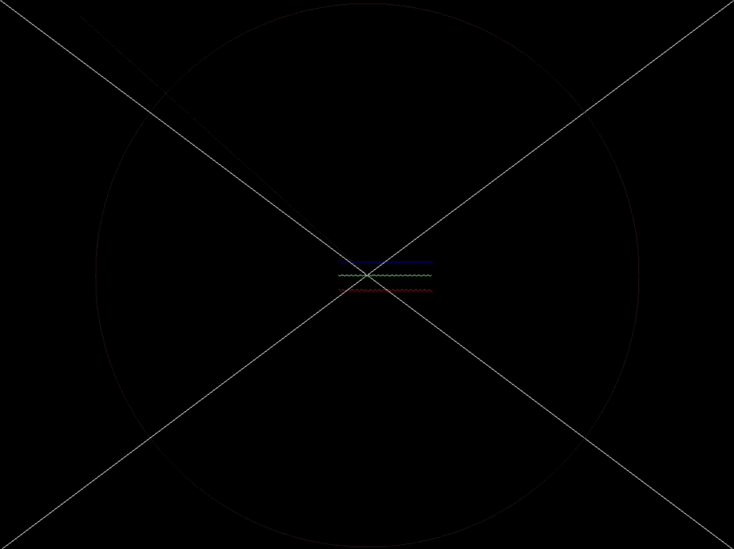

# WEFX

WEFX is a simple graphics drawing package using Zig, WASM, and an HTML canvas.

See it live at: https://daneelsan.github.io/zig-wefx/



This is a port of the original implementation written in C found in https://github.com/robrohan/wefx.

The library aims to serve a similar purpose to [gfx](https://www3.nd.edu/~dthain/courses/cse20211/fall2013/gfx/), in that it is simple and easy to learn. However, instead of having a [X11](https://en.wikipedia.org/wiki/X_Window_System) backend like the gfx library has, WEFX is meant to be compiled into a WASM module where the backend will be both Javascript and HTML5 canvas.

## API

The WEFX package can be found in the [wefx/WEFX.zig](./wefx/WEFX.zig) file.
WEFX.zig defines a struct with the following fields:

| Field                          | Description                                                                   |
| ------------------------------ | ----------------------------------------------------------------------------- |
| `allocator: std.mem.Allocator` | allocates memory for the screen and buffer                                    |
| `width: u32`                   | the maximum value of the x coordinate                                         |
| `height: u32`                  | the maximum value of the y coordinate                                         |
| `foreground_color: u32`        | the color used when drawing points, lines, etc.                               |
| `background_color: u32`        | the color used when clearing the screen                                       |
| `buffer: []u32`                | a slice of pixels which will be modified when drawing points, lines, etc.     |
| `screen: []u32`                | a slice of pixels which will be filled from the buffer when flush() is called |

And the following methods:
| Method | Description | GFX |
| ------ | ----------- | ----|
| `wefx.open(width: u32, height: u32)` | allocates memory for both the screen and buffer slices | `wefx_open(width, height, title)` |
| `wefx.clearColor(r: u8, g: u8, b: u8)` | change the current background color | `wefx_clear_color(r, g, b)` |
| `wefx.clear()` | clear the graphics screen to the background color | `wefx_clear()` |
| `wefx.color(r: u8, g: u8, b: u8)` | change the current drawing (foreground) color | `wefx_color(r, g, b)` |
| `wefx.point(x: u32, y: u32)` | draw a point at (x,y) | `wefx_point(x, y)` |
| `wefx.line(x1: u32, y1: u32, x2: u32, y2: u32)` | draw a line from (x1,y1) to (x2,y2) | `wefx_line(x1, y1, x2, y2)` |
| `wefx.circle(x: u32, y: u32, r: u32)` | draw a circle centered in (x,y) with radius r | |
| `wefx.flush()` | flush all previous output to the screen | `wefx_flush()` |

WEFX.zig also exports some functions/symbols that are meant to be used in the JS side:
| Export | Description |
| ------ | ----------- |
| `wefx_xsize(wefx: *WEFX)` | returns the width of the screen |
| `wefx_ysize(wefx: *WEFX)` | returns the height of the screen |
| `wefx_screen_offset(wefx: *WEFX)` | returns the pointer to the screen slice (an offset in the WASM memory) |
| `wefx_flush(wefx: *WEFX)` | calls wefx.flush() to fill the pixels in the screen |

## Writing an App

To write an app, the user will have to define two callbacks in a .zig file:
| Callback | Description |
| ------ | ----------- |
| `export fn init() ?*WEFX` | called once at the start of the app (should return a pointer to a WEFX instance) |
| `export fn main_loop(time: f32) void` | called every frame with time being time since app start |

These callbacks will be called from the [script.js](./docs/script.js) file.

## Build

The latest `zig`` version this project has been built in is:
```shell
$ zig version
0.12.0-dev.2341+92211135f
```

There are some examples in the examples/ directory.

The [build.zig](./build.zig) file by default builds the example1.zig file:

```shell
$ zig build --verbose
```

The output binary is called `wefx-example.wasm` and is stored in the `zig-out/lib/` directory:

```shell
$ ls zig-out/bin/*.wasm
zig-out/bin/wefx-example.wasm
```

Finally, copy it into the `docs/` directory so that the `script.js` file can load it:
```shell
$ cp zig-out/bin/wefx-example.wasm docs/wefx-example.wasm
```	

The user can simply modify the contents of the [example1.zig](./examples/example1.zig) file, or write a new file and modify the build.zig file to build it.

## TODO

The WEFX package should also handle events, i.e. mouse clicks and keyboard presses.

## Resources

-   https://github.com/robrohan/wefx
-   https://www3.nd.edu/~dthain/courses/cse20211/fall2013/gfx/
